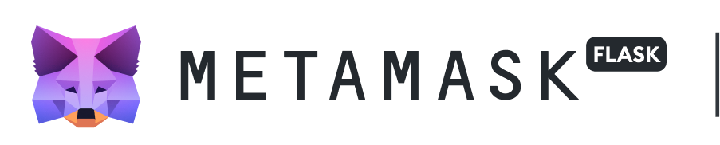
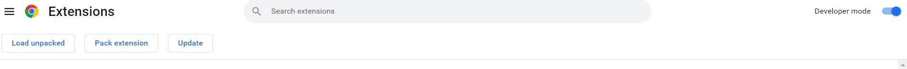
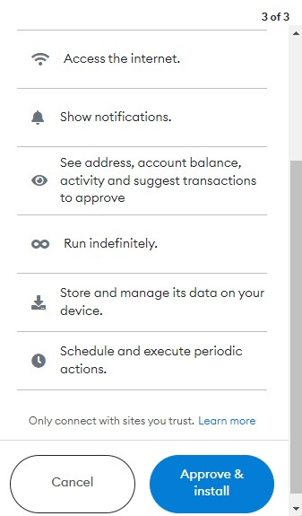
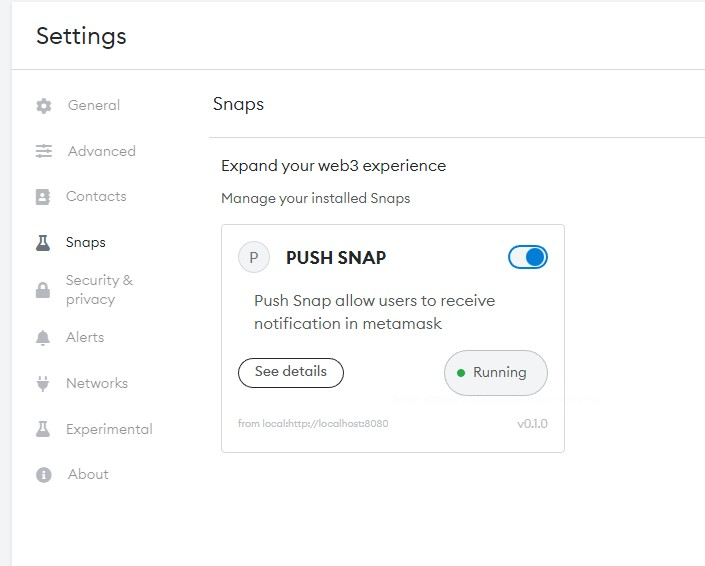
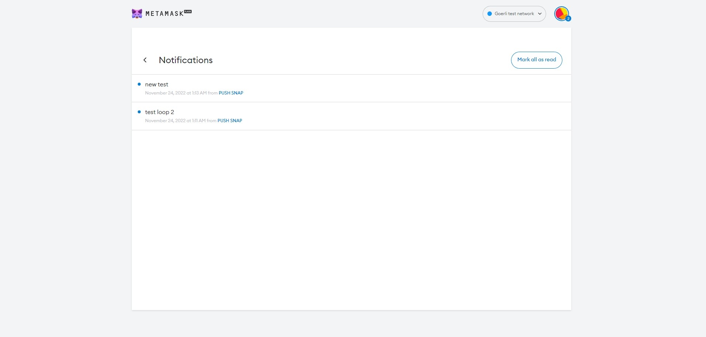
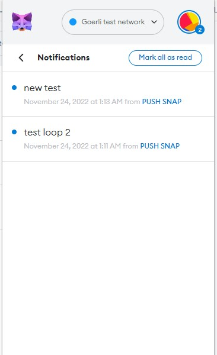

# METAMASK PUSH PROTOCOL NOTIFICATION SNAP

## This metamask snap will provide push notification to frontend of the metamask flask extension in brower.

**METAMASK SNAPS**

MetaMask Snap is a program that one can run in an isolated environment that can customize the wallet experience. In this snap is used to fetch user notification using push api and display to frontend of the metamask 

# Documentation

## For Frontend Users

Users need Metamask flask to run sanps.MetaMask Flask is a distribution of the software designed for developers. It's like a laboratory (hence the name) where the MetaMask team can try out new ideas and features.  
For running `PUSH SNAP` user to install this flask build: [Metamask Flask]("")

Step 1: **User need to install metmask flask build from the above link. In order to load the metamask build, the user must enable developer mode in their extensions.**
`(chrome/brave)->settings -> Extension` ( for enabling developer mode)

 
Step 2:

**After installing the metamask flask user need to create/import a wallet.**

 

Step 3:
**To receive notification to metamask user need to install `push snap` form this link [PUSH SNAP]("")**  

  

Step 4:
**In the push notification snap website user need to connect the metamask wallet. after connecting the installation process to install the snap will be started and metamask will ask permission to install the snap. Snap will ask different access permission for execution of the snap in the sandbox**

<table>
  <tr>
    <td valign="top">
    
    </td>
  </tr>
</table>
 
step 5:

**After installing the snap user can see installed sanp from metamask settings.`settings->snaps`**  

 

step 6: **After installing the snap. It will start to fetch notification and display it to metamask. Metamask has native and inapp notification support.**  

  
  

Following the above steps user can receive push notification in the metamask. Notification has some constraints and their solution will be explained in the developer documentation section.

## For developers

Snaps that have been installed will operate in a sandboxed environment and have access to metmask via api requests. Various requests require access permissions, which are granted during snap installation. 

 
Before we start the task, let's take a deep dive into Snap Ocean to learn more. snaps are installed inside the metamask application and run in `full virtualizable` execution environment, For more detials visit

[metamask docs](https://docs.metamask.io/guide/snaps.html#execution-environment)
