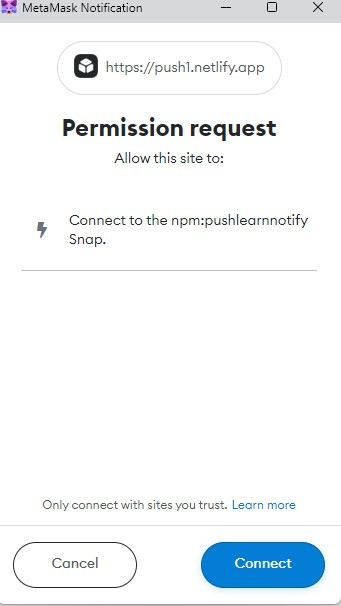
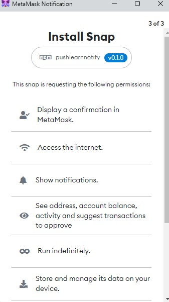

# METAMASK PUSH PROTOCOL NOTIFICATION SNAP

## This metamask snap will provide push notification to frontend of the metamask flask extension in brower.

**METAMASK SNAPS**

<p>MetaMask Snap is a program that one can run in an isolated environment that can customize the wallet experience. In this snap is used to fetch user notification using push api and display to frontend of the metamask </p>

# Documentation

## For Frontend Users

Users need Metamask flask to run sanps.MetaMask Flask is a distribution of the software designed for developers. It's like a laboratory (hence the name) where the MetaMask team can try out new ideas and features. <br>
For running `PUSH SNAP` user to install this flask build: [Metamask Flask]("")


Step 1: **User need to install metmask flask build from the above link. In order to load the metamask build, the user must enable developer mode in their extensions.**
`(chrome/brave)->settings -> Extension` ( for enabling developer mode)


<br>
Step 2:

**After installing the metamask flask user need to create/import a wallet.**

<br>

Step 3:
**To receive notification to metamask user need to install `push snap` form this link [PUSH SNAP](https://push1.netlify.app/)** <br>


<br><br>

Step 4:
**In the push notification snap website user need to connect the metamask wallet. after connecting the installation process to install the snap will be started and metamask will ask permission to install the snap. Snap will ask different access permission for execution of the snap in the sandbox**

<table>
  <tr>
    <td valign="top">
    
    </td>
    <td valign="top">
    
    </td>
     <td valign="top">
    
    </td>
  </tr>
</table>
<br>
step 5:

**After installing the snap user can see installed sanp from metamask settings.`settings->snaps`** <br>


<br>

step 6: **After installing the snap. It will start to fetch notification and display it to metamask. Metamask has native and inapp notification support.** <br>

 <br>
 <br>

Following the above steps user can receive push notification in the metamask. Notification has some constraints and their solution will be explained in the developer documentation section.

## For developers

**currently we cannot use `PUSHSDK` for fetching notification from the server in snaps. In `PUSHSDK` uses `axios` is another popular networking library that leverages `XMLHttpRequest` under the hood. currently snaps does not support `axios`.**

<p>Snaps that have been installed will operate in a sandboxed environment and have access to metmask via api requests. Various requests require access permissions, which are granted during snap installation. </p>

<br>
Before we start the task, let's take a deep dive into Snap Ocean to learn more. snaps are installed inside the metamask application and run in `full virtualizable` execution environment, For more detials visit

[metamask docs](https://docs.metamask.io/guide/snaps.html#execution-environment)

Understanding the snap lifespan is crucial. Snaps are made to awaken in reaction to rpc calls and events. A snap will be terminated if MetaMask notices that it has become unresponsive or idle.

- A snap is considered "unresponsive" if:
  - It has not received a JSON-RPC request for 30 seconds.
  - It takes more than 60 seconds to process a JSON-RPC request.

for more details visit [snap life cycle](https://docs.metamask.io/guide/snaps-development-guide.html#the-snap-lifecycle)

## Snap Manifest file

In order to get Metamask to execute snap, a valid `snap.manifest.json` file is rquired. located in `packages\snap\`

```json
{
  "version": "0.1.0",
  "description": " Push Snap allow users to receive notification in metamask",
  "proposedName": "PUSH  SNAP",
  "repository": {
    "type": "git",
    "url": "https://github.com/MetaMask/template-snap-monorepo.git"
  },
  "source": {
    "shasum": "JKeEDSd3GhJ/3PHTaJJ+1sQIVDOv9Uz5npqeFmSU85M=",
    "location": {
      "npm": {
        "filePath": "dist/bundle.js",
        "iconPath": "images/icon.svg",
        "packageName": "pushlearnnotify",
        "registry": "https://registry.npmjs.org/"
      }
    }
  },
  "initialPermissions": {
    "snap_confirm": {},
    "endowment:network-access": {},
    "snap_notify": {},
    "eth_accounts": {},
    "endowment:long-running": {},
    "snap_manageState": {},
    "endowment:cronjob": {
      "jobs": [
        {
          "expression": "* * * * *",
          "request": {
            "method": "check",
            "params": ["cronjob_param"]
          }
        }
      ]
    }
  },
  "manifestVersion": "0.1"
}
```

<br>
Manifest file holds importanat information about snap like hash ,initial permission,source location etc.

## permissions

we need permission in order to access different things in metamask. if a snap need to access eth_accounts it should mention in the manifest file. I am not explaning about all permissions in our mainfest file. You can vist [metamask docs](https://docs.metamask.io/guide/snaps-development-guide.html#permissions)

**`endowment:cronjob`** <br>

To display notifications in the metamask, we must periodically check for notifications using snap. Snaps are made to awaken in reaction to rpc calls and events. for perodic runnning of snap we are using cronojob.Cronjob feature will add new possibility to periodically run specific Snap RPC methods. Cronjob feature is implemented as a new permission with caveats that are used to specify job methods, parameters and schedule using CRON syntax.

```json
"endowment:cronjob": {
      "jobs": [
        {
          "expression": "* * * * *",
          "request": {
            "method": "check",
            "params": ["cronjob_param"]
          }
        }
      ]
    }
```

Supported format

```
*    *    *    *    *    *
┬    ┬    ┬    ┬    ┬    ┬
│    │    │    │    │    |
│    │    │    │    │    └ day of week (0 - 7, 1L - 7L) (0 or 7 is Sun)
│    │    │    │    └───── month (1 - 12)
│    │    │    └────────── day of month (1 - 31, L)
│    │    └─────────────── hour (0 - 23)
│    └──────────────────── minute (0 - 59)
└───────────────────────── second (0 - 59, optional)
```

in our push notfication snap it will check for new notification in every minutues. cronjob will send an RPC request to invoke `check` method to fetch the request from the sever using `push API`.

**`snap_manageState`**

`snap_manageState` is only Callable by
