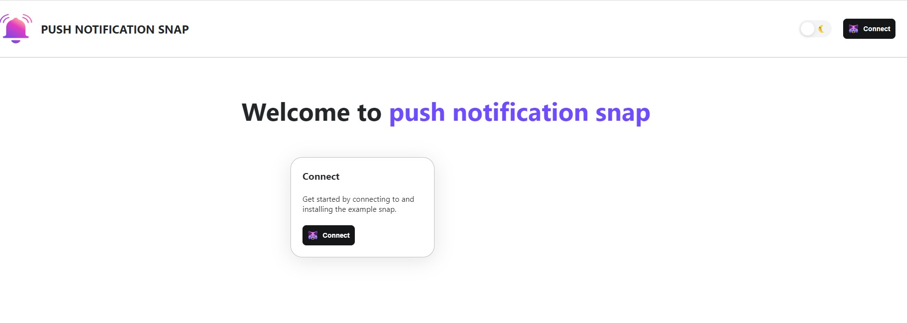

# METAMASK PUSH PROTOCOL NOTIFICATION SNAP

## This metamask snap will provide push notification to frontend of the metamask flask extension in brower.

**METAMASK SNAPS**

MetaMask Snap is a program that one can run in an isolated environment that can customize the wallet experience. In this snap is used to fetch user notification using push api and display to frontend of the metamask 

# Documentation

## For Frontend Users

Users need Metamask flask to run sanps.MetaMask Flask is a distribution of the software designed for developers. It's like a laboratory (hence the name) where the MetaMask team can try out new ideas and features.  
For running `PUSH SNAP` user to install this flask build: [Metamask Flask]("")

Step 1: **User need to install metmask flask build from the above link. In order to load the metamask build, the user must enable developer mode in their extensions.**
`(chrome/brave)->settings -> Extension` ( for enabling developer mode)

 
Step 2:

**After installing the metamask flask user need to create/import a wallet.**

 

Step 3:
**To receive notification to metamask user need to install `push snap` form this link [PUSH SNAP]("")**

 

Step 4:
**In the push notification snap website user need to connect the metamask wallet. after connecting the installation process to install the snap will be started and metamask will ask permission to install the snap.**

<table>
  <tr>
    <td valign="top"></td>
    <td valign="top"></td>
  </tr>
</table>
